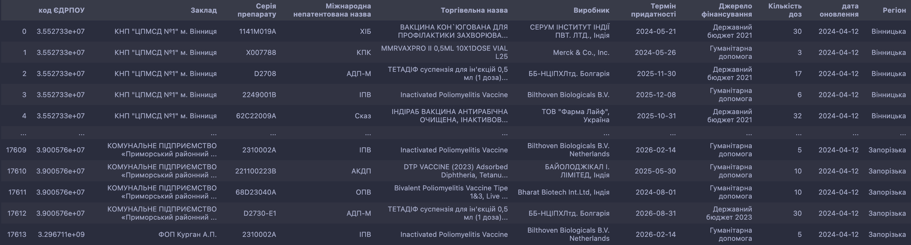
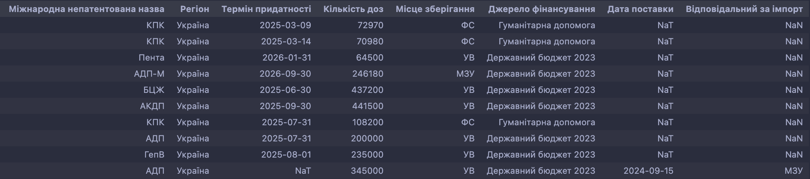
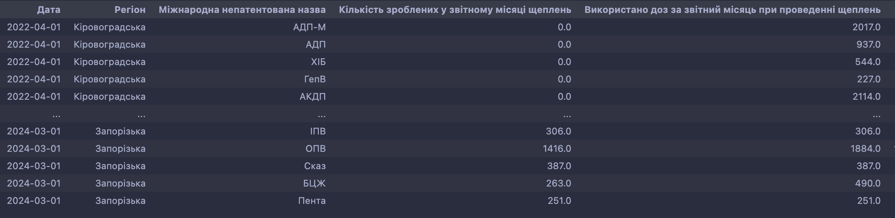

# Analytical Panels (aka, The VacBoard)

## Загальна інформація
### Опис проекту
Проект VacBoard є аналітичною платформою, яка надає зручний і швидкий доступ до аналізу даних про залишки вакцини в Україні. Цей проект розроблений з метою спрощення процесу аналізу і покращення менеджменту вакцини в Україні.

### Мета проекту
Головною метою проекту VacBoard є надання користувачам зручного інструменту для аналізу даних про залишки вакцини. Цей інструмент дозволяє швидко і ефективно отримувати інформацію про кількість вакцин, розподіл вакцин за регіонами, аналізувати тенденції споживання вакцин та багато іншого.

### Основні функції
Проект VacBoard надає наступні основні функції:

1. **Аналіз розподілу вакцин за регіонами і джерелами фінансування**: Користувач може переглядати і аналізувати кількість вакцин, розподілених за регіонами. Це дозволяє зрозуміти, які регіони мають найбільшу кількість вакцин і які регіони можуть потребувати додаткових поставок.

2. **Аналіз споживання вакцин**: Користувач може вивчити тенденції споживання вакцин за регіонами і закладами. Це допомагає зрозуміти, які заклади мають найбільше споживання вакцин і які регіони можуть потребувати додаткових поставок. Також інструмент демонструє тренди споживання, прораховані для кожної області і кожної вакцини.

3. **Прогнозування забезпеченості вакцинами**: Проект VacBoard надає можливість прогнозувати інтервали часу, на які регіони забезпечені вакциною. Це дозволяє планувати поставки вакцин і забезпечувати належне покриття вакцинами в усіх регіонах.

4. **Візуалізація даних**: Проект VacBoard надає зручні графіки та діаграми для візуалізації даних про вакцинацію. Це допомагає користувачам легко сприймати інформацію та зрозуміти основні тенденції.


## Завантаження і запуск проекту

### Технічні вимоги:

Перш ніж почати, переконайтеся, що ви виконали наступні вимоги:

- **Node.js**: Вам знадобиться Node.js для запуску JavaScript-частин цього проекту, які включають Webpack, Babel та React. Ви можете завантажити Node.js [звідси](https://nodejs.org/). Цей проект було протестовано з версією `Node.js 21.7.3`, однак новіші версії також повинні працювати.

- **Python**: Основною робочою силою проекта є Python, тому рекомендую мати один з собою. Ви можете завантажити Python [звідси](https://www.python.org/downloads/). Цей проект було створено і протестовано з `Python 3.11`.

- **Pipenv**: Pipenv використовується для керування залежностями Python та створення віртуального середовища. Якщо у вас ще не встановлено Pipenv, ви можете встановити його за допомогою команди `pip install pipenv`.

Після встановлення цих інструментів ви можете завантажити проект та встановити його залежності.


### Короткий опис бібліотек та інших технічних засобів, використаних у проекті

- **Pandas**: Бібліотека Python для обробки та аналізу даних. Вона надає структури даних та функції, необхідні для маніпулювання числовими таблицями та часовими серіями.

- **React**: JavaScript-бібліотека для побудови користувацьких інтерфейсів. Дозволяє створювати великі веб-додатки, які можуть змінювати дані, не перезавантажуючи сторінку.

- **Apache ECharts**: Потужна бібліотека візуалізації даних, яка працює з JavaScript. Вона надає простий спосіб додавання інтерактивних графіків та діаграм до веб-додатків.

- **Babel**: Це транспілятор JavaScript, який перетворює код ES6 і новіші версії на зворотну сумісну версію JavaScript, яку можна запустити в поточних та старих браузерах.

- **Webpack**: Інструмент, який допомагає організувати та управляти JavaScript-кодом проекту. "Пакує" модулі (фрагменти коду) в один або кілька файлів, які легко підключити до веб-сторінки. Це особливо корисно для великих проектів, де є багато залежностей між модулями.

### Завантаження проекту з репозиторію і встановлення залежностей

Для початку роботи з проектом VacBoard, вам потрібно завантажити його з репозиторію і встановити всі необхідні залежності. Для цього слід виконати наступні кроки:

> Приблизний загальний час виконання наступних трьох кроків – 10хв

1. **Клонування репозиторію**: Відкрийте термінал або командний рядок і перейдіть до каталогу, в якому ви хочете зберегти проект VacBoard. Введіть наступну команду, щоб склонувати репозиторій:

    ```shell
    git clone https://github.com/NonPersistentMind/VacPlanner.git
    ```

2. **Встановлення JavaScript залежностей**: Перейдіть до каталогу проекту VacBoard, який ви щойно склонували. Введіть наступну команду, щоб встановити всі необхідні залежності:

    ```shell
    npm install
    ```

    Ця команда встановить всі залежності, зазначені у файлі `package.json`.

3. **Встановлення Python залежностей**: Залишаючись у каталозі проекту, встановіть необхідні Python бібліотеки, використовуючи наступну команду:
   
    ```shell
    pipenv install
    ```

4. **Конфігурація**: Переконайтеся, що ви налаштували проект VacBoard згідно зі своїми потребами. Відредагуйте файли конфігурації, які знаходяться у каталозі проекту, щоб встановити параметри, які відповідають вашим вимогам. Усі доступні конфігурації (джерело даних, стандартний shelf life вакцини і тому подібне) знаходяться і є задокументованими у файлі `config.py` 

5. **Запуск проекту** (***Приблизний час виконання – 1хв***): Після завершення налаштування ви можете запустити проект VacBoard. Введіть наступну команду, щоб запустити проект:

    ```shell
    pipenv shell
    python main.py
    ```

    > Ця команда виконає необхідні розрахунки і вкладе оновлені дані у файл з назвою app-source.js
    > Після закінчення виконання програма автоматично збере проект і покладе готовий до використання дашборд у каталог `/docs`. Відкрийте файл `/docs/index.html` щоб побачити готову аналітичну панель.

6. **Публікація проекту** (***Приблизний час виконання – 10хв***): Для публікації проекту за загальнодоступним посиланням, викладіть проект у свій GitHub репозиторій і налаштуйте GitPages. Достатньо кількох кліків у налаштуваннях репозиторію: в меню зліва оберіть GitPages, після чого оберіть каталог `/docs` як основний каталог для веб-сторінки. Зачекайте кілька хвилин і побачите Ваше посилання на дашборд.

7. **Оновлення проекту** (***Приблизний час виконання – 2хв***): В майбутньому, достатньо виконати `main.py`, після чого оновити файли в репозиторію шляхом команди:

    ```shell
    git add -A
    git commit -m "Update *current_date*"
    git push
    ```

    > Ці команди оновлять код на хмарному репозиторію і GitPages автоматично оновить код за загальнодоступним посиланням, отриманим в пункті 6


## Дані, з якими працює проект

### Вимоги до основного джерела даних
Для коректної роботи проекту VacBoard, дані повинні мати наступні складові:

1. **ЄДРПОУ закладу**: Цей ідентифікатор використовується для уніфікації закладів і уникнення дублікатів.

2. **Регіон**: Інформація про регіон, в якому знаходиться заклад.

3. **Назва закладу**: Назва закладу або унікальне відображення ЄДРПОУ в назву.

4. **Назва вакцини**: Назва вакцини або серія вакцини.

5. **Термін придатності**: Дата, до якої вакцина є придатною для використання.

6. **Дата оновлення**: Дата оновлення запису.

7. **Кількість доз вакцини**: Кількість доз вакцини в закладі на вказану дату оновлення.

8. **Використання вакцин**: Інформація про використання вакцин за регіонами або закладами у розрізі місяців.

***Наразі джерелом даних може бути:***
* `.xlsx` файл всередині директорії `Data` всередині проекту
* Посилання на конкретний лист Google Spreadsheet файлу з описаною структурою
* Посилання на MedData API

> Зараз дані у форматі, придатному до використання, будучи обробленими бібліотекою `pandas`, мають наступний вигляд:



### Вимоги до інших джерел даних
Для використання проекту VacBoard, окрім основного джерела даних, потрібні ще принаймні 2:

#### 0.1 (Необовʼязковий): Скорочення назв вакцин, які зустрічаються в полі "Міжнародна непатентована назва". 
> Використовується для покращення візуалізаційної естетики (***і незначно пришвидшує виконання*** 😬)

#### 1. Джерело даних про залишки на національному рівні і про майбутні поставки
> Формат, придатний до використання – єдиний файл (або посилання на Google Spreadsheet) наступного вигляду (майбутні поставки відрізняються наявністю даних у полі **"Дата поставки"**):



#### 2. Джерело даних про використання вакцини на рівні регіонів (і, можливо, закладів) помісячно. Формат:




## Внесення змін
Якщо ви бажаєте внести зміни до проекту VacBoard, слід дотримуватися наступних кроків:

1. **Клонування репозиторію**: Склонуйте репозиторій проекту VacBoard на свій комп'ютер.

2. **Внесення змін**: Внесіть необхідні зміни до коду проекту VacBoard.

3. **Тестування**: Переконайтеся, що ваші зміни не порушують роботу проекту VacBoard. Виконайте необхідні тести (деякі з них уже включені в проект), щоб переконатися в правильності роботи.

4. **Запит на злиття**: Зробіть запит на злиття (pull request) зі своїми змінами до основного репозиторію проекту VacBoard. Очікуйте на перегляд та затвердження вашого запиту.

## Внесок
Якщо ви бажаєте внести свій внесок до проекту VacBoard, Ви можете:

- **Повідомити про помилку**: Якщо Ви знайшли помилку або проблему в проекті VacBoard, повідомте про це, створивши відповідний issue в репозиторії проекту.

- **Покращити документацію**: Якщо Ви бачите можливості для покращення документації проекту VacBoard, Ви можете внести свої зміни і запропонувати їх у вигляді запиту на злиття.

- **Розробити нові функції**: Якщо у вас є ідеї для нових функцій або покращень проекту VacBoard, Ви можете розробити їх і запропонувати у вигляді запиту на злиття.

## Завершення
Дякуємо, що обрали проект VacBoard для аналізу даних про вакцинацію. Маю надію, що проект багатократно примножить Ваші аналітичні якості, зробивши аналіз зручним та ефективним.
